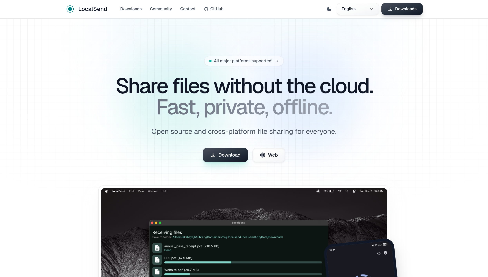

# Github_Project_Sharing

[Project Page](https://github.com/RichardHu6666/Github_Project_Sharing)

觉得好不妨点一个Star, thanks a lot!🤩🤩🤩

## Menu
[1 LocalSend 本地网络文件分享](https://richardhu6666.github.io/Github_Project_Sharing/#1-localsend-%E6%9C%AC%E5%9C%B0%E7%BD%91%E7%BB%9C%E6%96%87%E4%BB%B6%E5%88%86%E4%BA%AB)

## Details

### 1 LocalSend 本地网络文件分享

本地网络实现文件分享的方案，速度实测可达 8-10MB/s。校园网环境下可能需要手动输入 ip 进行匹配。

[LocalSend Github Page](https://github.com/localsend/localsend?tab=readme-ov-file)

[LocalSend Org Page](https://localsend.org/)

[SEU CloudDrive](https://pan.seu.edu.cn/link/AADD44FFD13C024EAAAC38E20BA4C33A01)
云盘中包含 LocalSend 1.17.0 windows-x86-64, android-arm64v8, linux-x86-64 版本包
